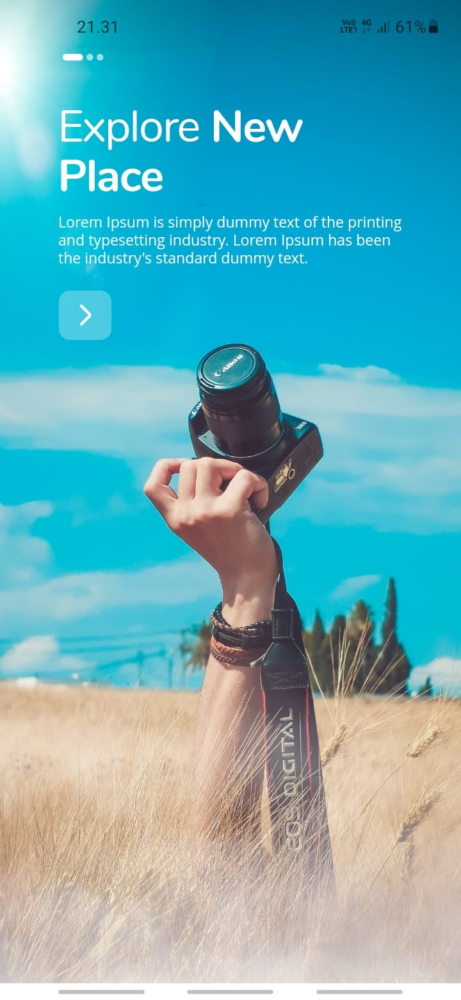
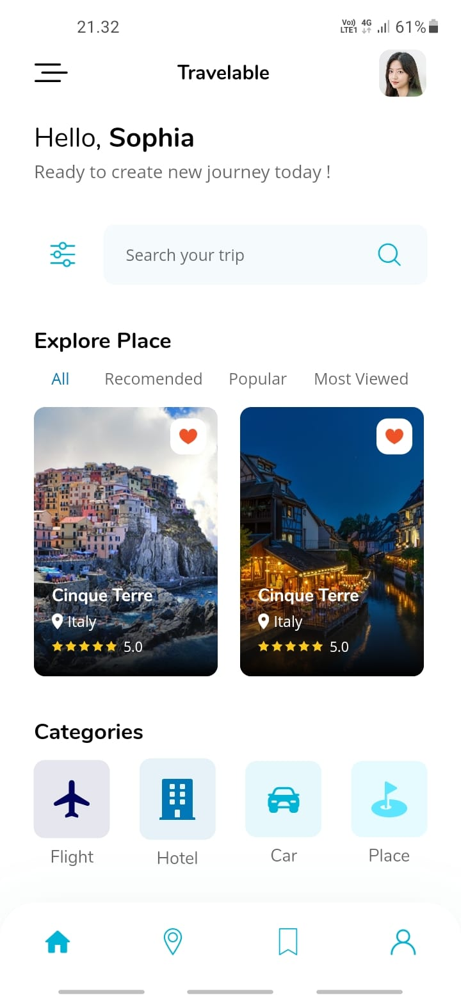
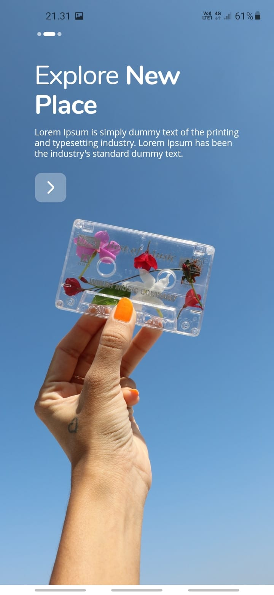
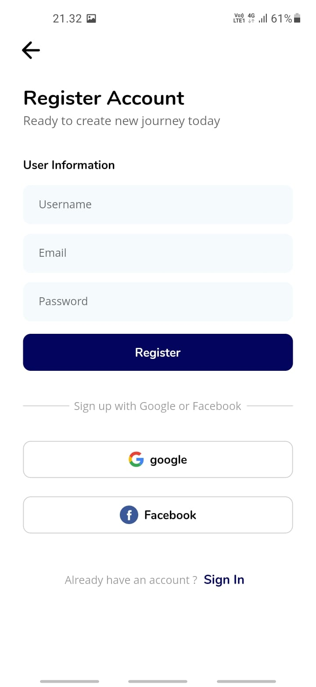
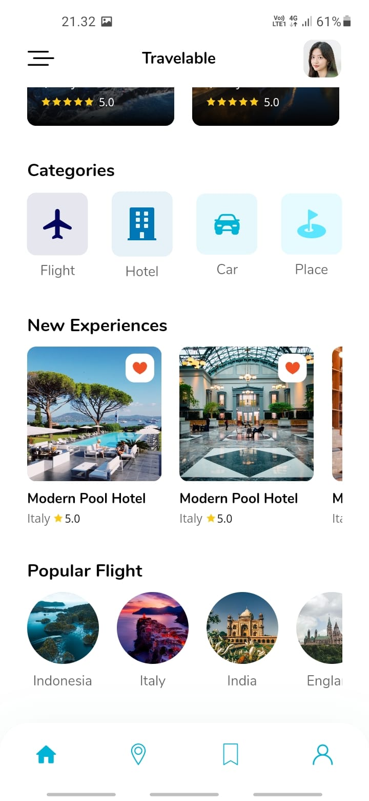

<h1 align="center">Travelable</h1>

Travelable is mobile android app to make it easier for travelers to book hotels, flights, and some place. Travelable provide many place to visit and create make travel experience more fun and easier. more choices for flight ticket, lots variation of hotels to stay.

#### Features

- Authentication User: Login, register, send validation with custom API
- Travel recomendation
- Search many place, flight, and hotel
- Book and payment system 
- Save favorite information for place, flight, and hotel
- Custom travel experience

#### Platform

Android

### Project status

This project is still in development

# Getting started

Run flutter project.

``
flutter run
``

# What's included

- Introduction Page
- Authentication User
- CRUD data integrated with custom API
- Book and payment system
- Saved favorite item
- Dependency Injection
- Validation
- Unit tests including code coverage
- Search bar
- Detail information item

### GetX

this project using GetX to handle API request, state management, and route.

### Custom API

this project integrated with [Custom API](https://gitlab.com/pratamailham206/travelable-api-laravel) using Express Node Js 

# Authors

* Ilham Pratama - [Gitlab](https://gitlab.com/pratamailham206)

# Screenshot

# License

This project is licensed under the MIT License - see the [LICENSE](LICENSE) file for details
